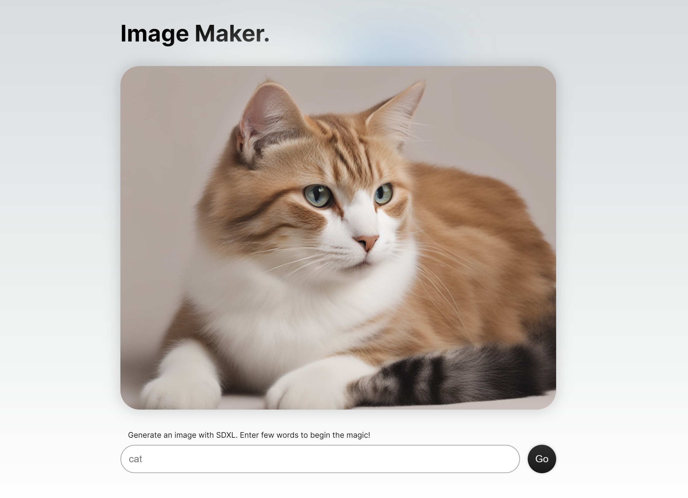

## SDXL Image Generator
 This project uses SDXL model on [Replicate](https://replicate.com) to generate images based on a prompt.
 Uses NextJS App Router, experimental Server Actions and [Replicate SDK](https://github.com/replicate/replicate-javascript).
 


Live Preview: https://image-maker-mu.vercel.app/

Note: I used this project for playground for the experimental [Server Actions](https://nextjs.org/docs/app/api-reference/functions/server-actions) and foundation for a project with Replicate SDK.
Currently, it makes more sense to implement the polling for image progress with Route Handlers and/or Replicate Webhook.

## Getting Started

1. Create `.env` with your [Replicate API Token](https://replicate.com/account/api-tokens)

```
REPLICATE_API_TOKEN="<YOUR API TOKEN>"
```

2. Npm Install
```bash
npm install
```

3. Run the development server:

```bash
npm run dev
```

### Project structure
Based on NextJS [App Router](https://nextjs.org/docs/app)

`src/config/replicate.config.js` - Config for default input and model params

`src/app/actions/replicate.js` - Server Actions for Replicate SDK

`src/app/(generator)` - Client Components for the Image Generator

`src/app/page.js` -Entry point

`src/app/images/[id]/page.js` - Image page


### Improvement ideas
- Polling of image progress with client-side HTTP requests and Route Handlers, instead of Server Actions.
- Loading indicators
